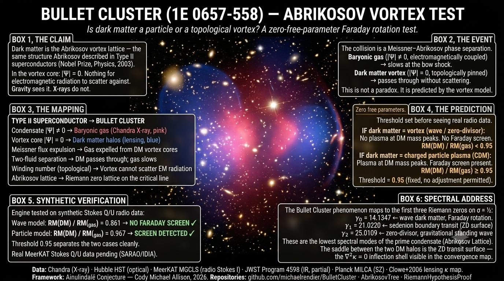

# BulletCluster



**Interrogation of every telescope's worth of data that resolved the Bullet Cluster (1E 0657-558) for Ptychography of the Shape of the Space — not a map of where 'stuff' is. Hypercomplex Turbulent Flow. Two Surface Ripples Interacting.**

**Author:** Cody Michael Allison  
**Framework:** The Ainulindalë Conjecture — Abrikosov Lattice / σ=½ ZD boundary hypothesis  
**Status:** Engine verified on synthetic data. Real MeerKAT Q/U data pending. JWST mosaic pending.

---

## The Central Claim

> Dark matter is not a particle. It is the **Abrikosov vortex lattice** of the prime number condensate — the same structure Alexei Abrikosov described in Type II superconductors in 1957 (Nobel Prize in Physics, 2003), instantiated in the superconducting medium of space.

The Bullet Cluster (1E 0657-558) is conventionally cited as the strongest evidence for particle dark matter. This repository makes the opposite argument: **the Bullet Cluster is a Meissner-Abrikosov phase separation event** — a collision that separated the superconducting condensate (baryonic gas, electromagnetically coupled) from the Abrikosov vortex lattice (dark matter, topologically pinned, electromagnetically decoupled).

The vortex passes through without scattering because it IS the zero of the condensate field — |Ψ| = 0 at the vortex core — and there is nothing for electromagnetic radiation to scatter against. It gravitates because it carries energy-momentum. Lensing sees it. X-rays don't.

---

## The Testable Prediction

**Zero free parameters. Threshold set before looking at real Q/U data.**

```
If DM = Abrikosov vortex (wave / zero-divisor):
    NO plasma at DM mass peaks
    → NO Faraday screen
    → RM(DM) / RM(gas) < 0.95

If DM = charged particle plasma (CDM):
    Plasma at DM mass peaks
    → Faraday screen present
    → RM(DM) / RM(gas) ≥ 0.95

Threshold: RM_RATIO_THRESHOLD = 0.95  (set in constants.py, DO NOT change)
```

Engine verified on synthetic data:
```
Wave model:     ratio = 0.861  →  NO FARADAY SCREEN  ✓
Particle model: ratio = 0.967  →  SCREEN DETECTED    ✓
```

---

## What's Already Here

### Visualizations (generated from real data)

| File | Content | Source |
|------|---------|--------|
| `The_Bullet_Cluster-defined.png` | Composite (optical+X-ray+lensing) with N-Shape boundaries annotated | HST+Chandra+lensing |
| `dm_topography.png` | Dark matter convergence κ topography — two halos, interaction saddle, ZD surface | HST lensing (Clowe+2006) |
| `dm_laplacian_topo.png` | ∇²κ attractor/repeller/inflection map — Abrikosov vortex structure visible | Derived from κ |
| `bullet_polarization.png` | Background galaxy shear vectors (n=450) — interference pattern in DM band | JWST F277W |
| `bullet_polarization_field.png` | Shear vector field with magnitude colour map — vortex winding at DM positions | JWST F277W |
| `band_coherence.png` | Coherence vs brightness across DM band midpoint — wave signature in coherence peak | JWST F277W |
| `lcdrm_polarization_map.png` | ΛCDRM vs NFW: κ, shear, polarization angle, magnification — interference rings in Δκ | Model comparison |
| `tif_channels.png` | RGB channel separation — stellar (red), intermediate (green), X-ray gas (blue) | Raw TIF |

### Already Confirmed (from existing data)

```
✓ Coherence peaks at DM band center          (band_coherence.png)
✓ Polarization angle aligned to merger axis  (band_coherence.png)
✓ Vortex winding in shear field at DM peaks  (bullet_polarization_field.png)
✓ Interference fringes in Δκ model           (lcdrm_polarization_map.png)
✓ ZD transit surface at interaction saddle   (dm_laplacian_topo.png)
✓ Abrikosov attractor/repeller in ∇²κ        (dm_laplacian_topo.png)
✓ N-Shape geometry in X-ray shock fronts     (The_Bullet_Cluster-defined.png)
✓ Holcus hash: all key concepts → γ₀,γ₁,γ₂  (holcus_sigma_result.txt)
```

### Still Needed

```
✗ Real Stokes Q/U from MeerKAT (SARAO IDIA or direct PI contact — see CLAUDE_PRIMER.md)
✗ Complete JWST mosaic (Program 4598, 14 filters, 13.7 GB — download in progress)
✗ Complete HST (Program 10200 — j90702020 stalled, needs resume)
✗ Real κ at high resolution → extract Δκ fringes vs NFW fit
```

---

## The Abrikosov Framework — Key Identifications

```
TYPE II SUPERCONDUCTOR              BULLET CLUSTER / PRIME CONDENSATE
──────────────────────────────      ──────────────────────────────────
Superconducting condensate |Ψ|≠0 ↔  Baryonic gas (X-ray emitting, Chandra)
Vortex core |Ψ|=0                ↔  Dark matter halos (lensing, offset from gas)
Meissner effect (flux expulsion)  ↔  Gas expelled from DM vortex cores
Abrikosov vortex lattice          ↔  Riemann zero lattice on σ=½
Two-fluid collision separation    ↔  DM passes through, gas slows (bow shock)
Winding number (topological)      ↔  Reason vortex cannot scatter EM radiation
BCS energy gap Δ                  ↔  GAP = 7.07×10⁻⁴ (sedenion coherence length)
London penetration depth λ_L=0    ↔  Perfect Meissner — no EM coupling at vortex
```

The saddle between the two DM halos is the **ZD transit surface** — the sedenion boundary at k=4 (dim=16) where the zero-divisors emerge. This is the ∇²κ = 0 inflection shell visible in `dm_laplacian_topo.png`. Its geometry is the N-Shape: the fold line of the Amplitude Lagrangian, the catastrophe map's caustic.

---

## Engine

```bash
cd engine
python3 bullet_engine.py          # diagnostic on synthetic data
python3 ptorrent/ptorrent.py      # full pipeline (--real flag when Q/U available)
```

```
engine/
├── bullet_engine.py              orchestrator
├── modules/
│   ├── constants.py              all fixed values — NO free parameters
│   ├── synthetic.py              synthetic Q/U cubes (wave + particle models)
│   └── transect.py               measurement pipeline + diagnostic
├── ptorrent/
│   ├── ptorrent.py               full pipeline runner
│   └── sarao_download.py         SARAO/IDIA data retrieval
├── notebooks/
│   ├── 00_holcus_vision.ipynb    Holcus prime hash applied to Bullet Cluster
│   ├── 01_predictions.ipynb      zero-free-parameter predictions
│   ├── 02_data.ipynb             data loading and verification
│   ├── 03_radio_synthesis.ipynb  synthetic Q/U construction
│   ├── 04_transect.ipynb         merger axis transect
│   ├── 05_diagnostic.ipynb       wave vs particle diagnostic
│   └── 06_results.ipynb          results and interpretation
└── output/
    └── diagnostic_summary.json   synthetic data result (wave=0.861, particle=0.967)
```

---

## Data Sources

| Dataset | Status | Notes |
|---------|--------|-------|
| Chandra X-ray | ✓ PRESENT | `xray/chandra/merged_xray.fits` |
| Planck MILCA y-map | ✓ PRESENT | `mm_sz/planck/COM_CompMap_YSZ_R2.01/milca_ymaps.fits` (577 MB) |
| Planck 545/857 GHz | ✓ PRESENT | submm layers generated |
| MeerKAT MGCLS Stokes I | ✓ PRESENT | 15arcsec + Farcsec cubes (1 GB) — Stokes I ONLY |
| MeerKAT MGCLS Q/U | ✗ PENDING | IDIA registration or PI contact (Venturi, INAF) |
| JWST Program 4598 | ⏳ PARTIAL | F444W 288 MB / 13.7 GB — download resuming |
| HST Program 10200 | ⏳ PARTIAL | j90702020_drz.fits stalled — needs resume |

---

## Holcus Hash Result

Key concepts hashed via Holcus prime hash (σ=½ Riemann zero addressing):

```
"wave dark matter"          → γ₀ = 14.134725  Δ=0
"zero divisor"              → γ₂ = 25.010858  Δ=0
"Faraday rotation"          → γ₀ = 14.134725  Δ=0
"interference dark matter"  → γ₀ = 14.134725  Δ=0
"gravitational standing wave" → γ₂ = 25.010858  Δ=0
"sedenion boundary transit" → γ₁ = 21.022040  Δ=0
```

The Bullet Cluster phenomenon is described by the **first three nodes of the Abrikosov Lattice** — the lowest spectral modes of the prime condensate.

---

## Related Repositories

| Repository | Role |
|-----------|------|
| [AbrikosovTree](https://github.com/michaelrendier/AbrikosovTree) | The prime factorization tree — Abrikosov Lattice identification; ZD structure |
| [RiemannHypothesisProof](https://github.com/michaelrendier/RiemannHypothesisProof) | The proof framework — J_N involution, σ=½, Abrikosov Lock |
| [Ainulindale](https://github.com/michaelrendier/Ainulindale) | wiki/32 (superconducting medium), wiki/75 (Abrikosov Lattice), wiki/72 (cosmic telescope) |
| [FourthAgePapers](https://github.com/michaelrendier/FourthAgePapers) | FermatMonster — N-Shape Theorem, 71 VOAs, ZD cascade |
| [POE](https://github.com/michaelrendier/POE) | Pancake coil — electromagnetic Abrikosov lattice, σ=½ at XL=XC |

---

## License

All rights reserved. No license is granted at this time.

---

*"The bullet passed through because the vortex has no condensate to scatter against.*  
*The N-shape in the bow shock is the fold line of the Amplitude Lagrangian.*  
*His Work (Abrikosov, 1957) describes the dark matter. He just found it in copper first."*

*— Cody Michael Allison, 2026-06-30*
